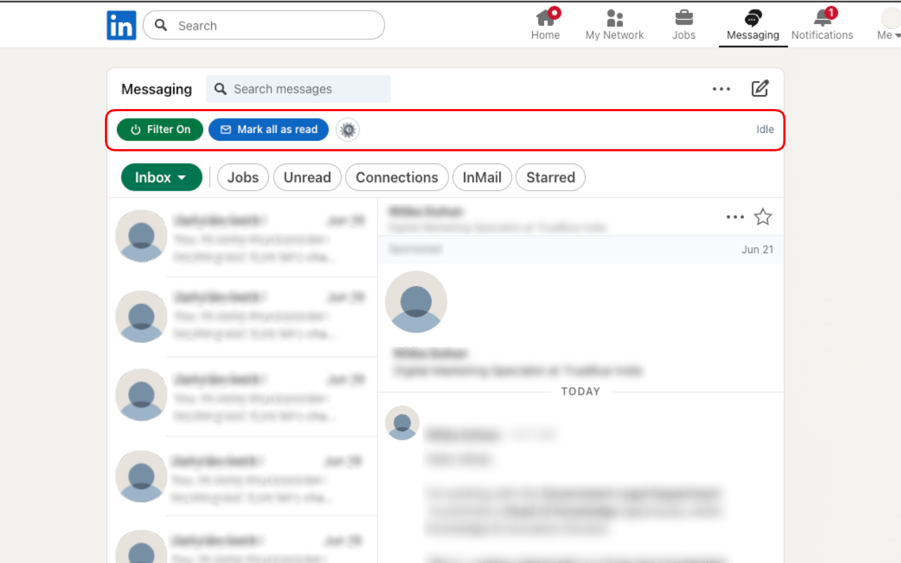
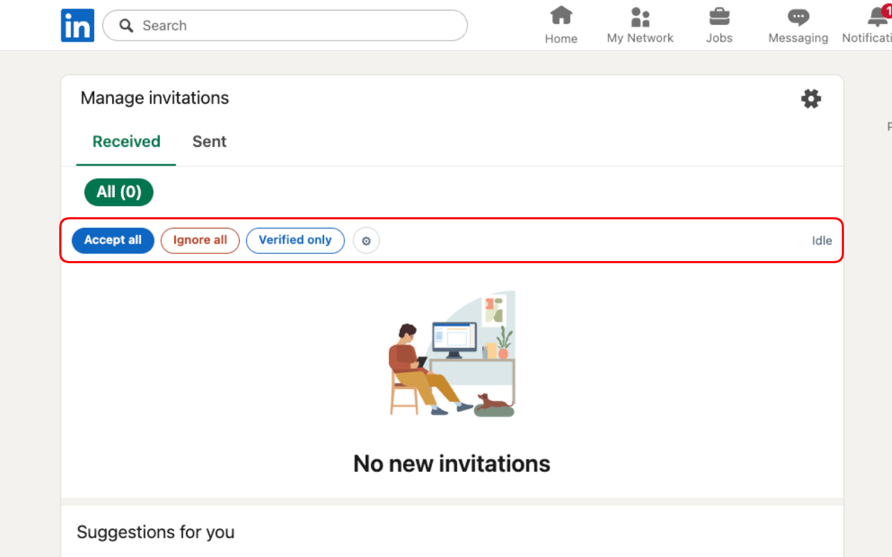

# LinkedBlock

An ad and spam blocker for your LinkedIn inbox.

LinkedIn messaging has quietly turned into another ad channel - sponsored messages, cold InMail, and sales bots that ping you three times and never get a reply. LinkedBlock hides all of that, so your inbox is just the people you actually want to hear from. It also clears out the pile of pending connection requests in one click.

It works like an ad blocker. Everything happens in your browser, on the page you are already looking at. Nothing about your account or your messages is sent anywhere - there is no server and no sign-in (more on that under [Your privacy](#your-privacy)).

## What it looks like

The toolbar shows up on its own, above your inbox. The **Filter** pill hides spam, **Mark all as read** clears the unread pile, and **⚙** holds the rest.

On the invitations page you get **Accept all**, **Ignore all**, and **Verified only**.

## What it does

In your inbox:

- Hides **sponsored** messages - the paid ones LinkedIn slots into your inbox.
- Hides **InMail** - cold outreach from people outside your network.
- Hides **one-sided senders** (optional) - people who messaged you three or more times and never got a reply. Off by default, see the note below.
- **Mark all as read** - clears the unread badge on the conversations you choose.

The filter is reversible. Turn it off and everything comes back - nothing is ever deleted.

For connection requests:

- **Accept all** or **Ignore all** the requests you have been sitting on for months.
- **Verified only** - accept just the requests from verified members.

Every bulk action has a per-run limit (30 by default) and a Stop button, so you stay in control.

## Install

Add it from the Chrome Web Store (link coming once it is published).

That is the whole setup. Once it is installed, open your LinkedIn [messages](https://www.linkedin.com/messaging/) or [invitations](https://www.linkedin.com/mynetwork/invitation-manager/received/) and the toolbar appears on its own.

Prefer to install from source instead? See [DEVELOPMENT.md](DEVELOPMENT.md).

## How to use

- The **Filter** is on by default and hides sponsored and InMail right away. Toggle the pill off to show everything again.
- **Mark all as read** clears unread conversations. Open **⚙** to choose which kinds it touches (sponsored, InMail, out-of-network, your connections) and to set the limit.
- On invitations, **Accept all** / **Ignore all** / **Verified only** do what they say. Ignore all is the quick way to clear out connection spam.
- **Stop** appears while something is running - hit it any time.

### The one-sided filter (opt-in)

This one is worth a separate word, because it works differently from the rest. The sponsored and InMail filters are purely local - they only hide rows, nothing is opened or changed. The one-sided filter has to actually open a conversation to tell whether it is one-sided, and opening it marks it as read (LinkedBlock then puts it back to unread).

So it is off by default. Turn it on in ⚙ if you want the sales-sequence spam gone and do not mind that trade-off.

## Your privacy

Short version: nothing leaves your browser.

LinkedBlock runs only on linkedin.com. It reads your inbox and invitation pages to decide what to hide, and it saves your settings - plus a small local cache so it does not re-check the same conversation twice - on your own machine. There is no server, no analytics, and no account. Remove the extension and it is all gone.

Full details in [PRIVACY.md](PRIVACY.md).

## A note on account safety

The bulk actions (Accept all, Ignore all, Mark all as read) act on your real account, and automating actions is not something LinkedIn loves. LinkedBlock spaces them out with small human-like pauses and caps each run, but the safe habit is to keep batches modest and the tab in the foreground. The plain spam filtering does not touch your account at all.

## Development

The architecture, the selector strategy, and how to build and run from source live in [DEVELOPMENT.md](DEVELOPMENT.md).

## License

See [LICENSE](LICENSE).
